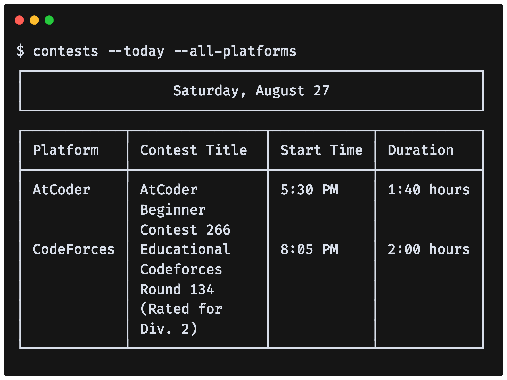

<div align="center">

<br>
command-line tool to get schedule of contests on <a href="https://atcoder.jp">atcoder.jp</a>, <a href="https://www.codechef.com">codechef.com</a>, <a href="https://codeforces.com">codeforces.com</a>, <a href="https://www.geeksforgeeks.org">geeksforgeeks.org</a> and <a href="https://leetcode.com">leetcode.com</a>.
<h1></h1>

</div>

<h1></h1>

## Installing on Ubuntu and its Derivatives

```sh
wget -q --show-progress https://github.com/er-knight/contests/releases/download/v0.1/contests.zip
```
```sh
unzip contests.zip
```
```sh
echo "export PATH=\$PATH:~/contests" >> .bashrc
```
```sh
source .bashrc
```
